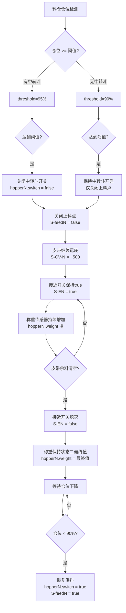

# 高位配料站满仓控制策略及传感器状态文档

## 一、系统参数

| 参数 | 数值 |
|------|------|
| 单个料仓容量 | **110吨** |
| 满仓触发阈值 | **95%** (104.5吨) |
| 无中转斗路线触发阈值 | **90%** (99吨) |
| 进料速率 | **0.195 t/s** |

---

## 二、皮带与小车对应关系

| 终点皮带 | 小车ID | 小车名称 | 目的地 | 传感器 |
|---------|-------|---------|-------|-------|
| D7 | Cart1 | D7运料小车 | P1配料站 | Cart1-Position, Cart1-LeftLimit, Cart1-RightLimit, Cart1-LeftDivert, Cart1-RightDivert |
| D8 | Cart2 | D8运料小车 | P2/P3配料站 | Cart2-Position, Cart2-LeftLimit, Cart2-RightLimit, Cart2-LeftDivert, Cart2-RightDivert |
| D9 | Cart3 | D9运料小车 | P4配料站 | Cart3-Position, Cart3-LeftLimit, Cart3-RightLimit, Cart3-LeftDivert, Cart3-RightDivert |
| D6 | Cart4 | D6运料小车 | 高位储料仓S1-S12 | Cart4-Position, Cart4-LeftLimit, Cart4-RightLimit, Cart4-LeftDivert, Cart4-RightDivert |

### 2.1 小车传感器详细规则

#### Cart1 (D7运料小车) — 仅服务于P1配料站

| 规则 | 说明 |
|------|------|
| **位置传感器** | 由当前补料的P1列产线决定，取值1-7 |
| **分料传感器** | P1列配料站位于小车**左侧**，因此：<br/>- `Cart1-LeftDivert` = **true** (始终保持)<br/>- `Cart1-RightDivert` = **false** (始终保持) |
| **极限传感器** | 由小车当前位置决定 |

**Cart1位置与P1产线对应关系：**

| 小车位置值 | 补料产线 | LeftDivert | RightDivert |
|-----------|---------|------------|-------------|
| 1 | P1-1 | true | false |
| 2 | P1-2 | true | false |
| 3 | P1-3 | true | false |
| 4 | P1-4 | true | false |
| 5 | P1-5 | true | false |
| 6 | P1-6 | true | false |
| 7 | P1-7 | true | false |

---

#### Cart2 (D8运料小车) — 服务于P2/P3配料站

| 规则 | 说明 |
|------|------|
| **位置传感器** | 由当前补料的产线决定，取值1-7 |
| **分料传感器** | 左侧为P2，右侧为P3：<br/>- 为P2列补料时：`Cart2-LeftDivert` = **true**， `Cart2-RightDivert` = **false**<br/>- 为P3列补料时：`Cart2-RightDivert` = **true**， `Cart2-LeftDivert` = **false** |
| **极限传感器** | 由小车当前位置决定 |

**Cart2位置与补料产线对应关系：**

| 小车位置值 | 补料产线 | LeftDivert | RightDivert |
|-----------|---------|------------|-------------|
| 1 | P2-1 或 P3-1 | true (P2时) / false (P3时) | false (P2时) / true (P3时) |
| 2 | P2-2 或 P3-2 | true (P2时) / false (P3时) | false (P2时) / true (P3时) |
| 3 | P2-3 或 P3-3 | true (P2时) / false (P3时) | false (P2时) / true (P3时) |
| 4 | P2-4 或 P3-4 | true (P2时) / false (P3时) | false (P2时) / true (P3时) |
| 5 | P2-5 或 P3-5 | true (P2时) / false (P3时) | false (P2时) / true (P3时) |
| 6 | P2-6 或 P3-6 | true (P2时) / false (P3时) | false (P2时) / true (P3时) |
| 7 | P2-7 或 P3-7 | true (P2时) / false (P3时) | false (P2时) / true (P3时) |

---

#### Cart3 (D9运料小车) — 仅服务于P4配料站

| 规则 | 说明 |
|------|------|
| **位置传感器** | 由当前补料的P4列产线决定，取值1-7 |
| **分料传感器** | P4列配料站位于小车**右侧**，因此：<br/>- `Cart3-RightDivert` = **true** (始终保持)<br/>- `Cart3-LeftDivert` = **false** (始终保持) |
| **极限传感器** | 由小车当前位置决定 |

**Cart3位置与P4产线对应关系：**

| 小车位置值 | 补料产线 | LeftDivert | RightDivert |
|-----------|---------|------------|-------------|
| 1 | P4-1 | false | true |
| 2 | P4-2 | false | true |
| 3 | P4-3 | false | true |
| 4 | P4-4 | false | true |
| 5 | P4-5 | false | true |
| 6 | P4-6 | false | true |
| 7 | P4-7 | false | true |

---

#### Cart4 (D6运料小车) — 服务于高位储料仓S1-S12

| 规则 | 说明 |
|------|------|
| **位置传感器** | 由当前补料的高位储料仓具体料仓决定，取值1-6 |
| **分料传感器** | 左侧为S1-S6，右侧为S7-S12：<br/>- 为S1-S6补料时：`Cart4-LeftDivert` = **true**， `Cart4-RightDivert` = **false**<br/>- 为S7-S12补料时：`Cart4-RightDivert` = **true**， `Cart4-LeftDivert` = **false** |
| **极限传感器** | 由小车当前位置决定 |

**Cart4位置与高位储料仓对应关系：**

| 小车位置值 | 补料料仓 | LeftDivert | RightDivert |
|-----------|---------|------------|-------------|
| 1 | S1 或 S7 | true (S1时) / false (S7时) | false (S1时) / true (S7时) |
| 2 | S2 或 S8 | true (S2时) / false (S8时) | false (S2时) / true (S8时) |
| 3 | S3 或 S9 | true (S3时) / false (S9时) | false (S3时) / true (S9时) |
| 4 | S4 或 S10 | true (S4时) / false (S10时) | false (S4时) / true (S10时) |
| 5 | S5 或 S11 | true (S5时) / false (S11时) | false (S5时) / true (S11时) |
| 6 | S6 或 S12 | true (S6时) / false (S12时) | false (S6时) / true (S12时) |

---

## 三、传感器类型说明

| 传感器类型 | ID格式 | 数据类型 | 状态说明 |
|-----------|-------|---------|---------|
| **料位传感器** | `{料仓ID}` | int | 料位百分比(0-100) |
| 接近开关 | `S-{皮带ID}` | bool | 物料经过时为true |
| 中转斗开关 | `hopper{n}.switch` | bool | true=开，false=关 |
| 称重传感器 | `hopper{n}.weight` | int | 囤积的物料重量 |
| 皮带转速 | `S-CV-{皮带ID}` | int | ~500为正常转速 |
| 上料控制信号 | `feed_{id}` | bool | true=上料点打开，false=上料点关闭 |
| 小车位置 | `Cart{n}-Position` | byte | 1-7 (Cart1/2/3)，1-6 (Cart4)，见各小车规则 |
| 小车极限 | `Cart{n}-LeftLimit/RightLimit` | bool | 小车当前位置限位 |
| 小车分料 | `Cart{n}-LeftDivert/RightDivert` | bool | 分料方向控制，见各小车规则 |

---

## 四、四种时序状态说明

> **注意**：启动路线时存在一个短暂的"小车移动中"阶段，用于等待小车移动到目标料仓位置。此阶段终点皮带停止，终点中转斗关闭。

| 状态 | 阶段 | 触发条件 | 主要变化 |
|------|------|---------|---------|
| **状态零** | 小车移动中 | 用户启动路线 | 终点皮带停止，终点中转斗关闭，上料信号false，非终点皮带继续运行 |
| **状态一** | 正常补料阶段 | 小车到位 | 上料点持续上料，中转斗开关打开，接近开关持续检测到物料(true) |
| **状态二** | 清空余料阶段 | 仓位达到阈值 | 上料点停止，中转斗关闭，皮带继续运转清空余料，接近开关脉冲式变化(余料经过时true，通过后false) |
| **状态三** | 停机待料阶段 | 皮带余料清空完毕 | 所有接近开关熄灭(false)，称重保持状态二最终值 |

### 4.1 启动顺序说明（以路线④为例）

点击启动路线④上料后，执行顺序如下：

```
1. 皮带D9停止转动
2. 中转斗6开关关闭
3. 上料点2-2停止生成物料（feed2_2 = false）
4. 小车Cart3开始移动（皮带E6、E7、E9同步启动）
5. 小车到达目标料仓位置后
6. 皮带D9启动
7. 中转斗6开关打开
8. 上料点2-2开始生成物料（feed2_2 = true）
```

---

## 五、每条路线传感器状态

### 路线① (route1) — 石粉 → P1配料站

```
路线: feed1_1 → E1 → hopper1 → E4 → hopper3 → E8 → hopper4 → E10 → hopper5 → D7 → Cart1 → P1-*
```

| 传感器类型 | 传感器ID | 状态零（启动阶段） | 状态一（正常补料） | 状态二（清空余料） | 状态三（停机待料） |
|-----------|---------|-------------------|-------------------|-------------------|-------------------|
| **接近开关** | `S-E1` | **false** (无料) | **true** (持续有料) | **true→false** (余料经过后变为false) | **false** |
| **接近开关** | `S-E4` | **false** (无料) | **true** (持续有料) | **true→false** (余料经过后变为false) | **false** |
| **接近开关** | `S-E8` | **false** (无料) | **true** (持续有料) | **true→false** (余料经过后变为false) | **false** |
| **接近开关** | `S-E10` | **false** (无料) | **true** (持续有料) | **true→false** (余料经过后变为false) | **false** |
| **接近开关** | `S-D7` | **false** (无料，等待小车) | **true** (持续有料) | **true→false** (余料经过后变为false) | **false** |
| **中转斗开关** | `hopper1.switch` | **true** (开) | **true** (开) | **false** (关) | **false** |
| **称重传感器** | `hopper1.weight` | **0** | **0** | **持续增加** → 最终值 | **保持状态二的最终值不变** |
| **中转斗开关** | `hopper3.switch` | **true** (开) | **true** (开) | **false** (关) | **false** |
| **称重传感器** | `hopper3.weight` | **0** | **0** | **持续增加** → 最终值 | **保持状态二的最终值不变** |
| **中转斗开关** | `hopper4.switch` | **true** (开) | **true** (开) | **false** (关) | **false** |
| **称重传感器** | `hopper4.weight` | **0** | **0** | **持续增加** → 最终值 | **保持状态二的最终值不变** |
| **皮带转速** | `S-CV-E1` | ~500 | ~500 | ~500 | ~500 |
| **皮带转速** | `S-CV-E4` | ~500 | ~500 | ~500 | ~500 |
| **皮带转速** | `S-CV-E8` | ~500 | ~500 | ~500 | ~500 |
| **皮带转速** | `S-CV-E10` | ~500 | ~500 | ~500 | ~500 |
| **皮带转速** | `S-CV-D7` | **0** (终点皮带停止) | ~500 | ~500 | ~500 |
| **上料控制信号** | `feed1_1` | **false** (关闭) | **true** (打开) | **false** (关闭) | **false** |
| **小车位置** | `Cart1-Position` | 由P1产线决定(1-7) | 由P1产线决定(1-7) | 保持当前 | 保持当前 |
| **小车左极限** | `Cart1-LeftLimit` | bool | bool | 不变 | 不变 |
| **小车右极限** | `Cart1-RightLimit` | bool | bool | 不变 | 不变 |
| **小车左分料** | `Cart1-LeftDivert` | **true** (P1在左侧) | **true** | **true** | **true** |
| **小车右分料** | `Cart1-RightDivert` | **false** | **false** | **false** | **false** |

> **小车说明**: Cart1服务于P1配料站，P1列位于小车左侧，因此LeftDivert恒为true。终点皮带为D7，在启动阶段停止。

---

### 路线② (route2) — 石粉 → P1配料站

```
路线: feed1_2 → E2 → hopper1 → E4 → hopper3 → E8 → hopper4 → E10 → hopper5 → D7 → Cart1 → P1-*
```

| 传感器类型 | 传感器ID | 状态零（启动阶段） | 状态一（正常补料） | 状态二（清空余料） | 状态三（停机待料） |
|-----------|---------|-------------------|-------------------|-------------------|-------------------|
| **接近开关** | `S-E2` | **false** (无料) | **true** (持续有料) | **true→false** (余料经过后变为false) | **false** |
| **接近开关** | `S-E4` | **false** (无料) | **true** (持续有料) | **true→false** (余料经过后变为false) | **false** |
| **接近开关** | `S-E8` | **false** (无料) | **true** (持续有料) | **true→false** (余料经过后变为false) | **false** |
| **接近开关** | `S-E10` | **false** (无料) | **true** (持续有料) | **true→false** (余料经过后变为false) | **false** |
| **接近开关** | `S-D7` | **false** (无料，等待小车) | **true** (持续有料) | **true→false** (余料经过后变为false) | **false** |
| **中转斗开关** | `hopper1.switch` | **true** (开) | **true** (开) | **false** (关) | **false** |
| **称重传感器** | `hopper1.weight` | **0** | **0** | **持续增加** → 最终值 | **保持状态二的最终值不变** |
| **中转斗开关** | `hopper3.switch` | **true** (开) | **true** (开) | **false** (关) | **false** |
| **称重传感器** | `hopper3.weight` | **0** | **0** | **持续增加** → 最终值 | **保持状态二的最终值不变** |
| **中转斗开关** | `hopper4.switch` | **true** (开) | **true** (开) | **false** (关) | **false** |
| **称重传感器** | `hopper4.weight` | **0** | **0** | **持续增加** → 最终值 | **保持状态二的最终值不变** |
| **皮带转速** | `S-CV-E2` | ~500 | ~500 | ~500 | ~500 |
| **皮带转速** | `S-CV-E4` | ~500 | ~500 | ~500 | ~500 |
| **皮带转速** | `S-CV-E8` | ~500 | ~500 | ~500 | ~500 |
| **皮带转速** | `S-CV-E10` | ~500 | ~500 | ~500 | ~500 |
| **皮带转速** | `S-CV-D7` | **0** (终点皮带停止) | ~500 | ~500 | ~500 |
| **上料控制信号** | `feed1_2` | **false** (关闭) | **true** (打开) | **false** (关闭) | **false** |
| **小车位置** | `Cart1-Position` | 由P1产线决定(1-7) | 由P1产线决定(1-7) | 保持当前 | 保持当前 |
| **小车左分料** | `Cart1-LeftDivert` | **true** | **true** | **true** | **true** |
| **小车右分料** | `Cart1-RightDivert` | **false** | **false** | **false** | **false** |

> **小车说明**: Cart1服务于P1配料站，P1列位于小车左侧，因此LeftDivert恒为true。终点皮带为D7，在启动阶段停止。

---

### 路线③ (route3) — 石粉 → P1配料站

```
路线: feed2_1 → E5 → hopper1 → E8 → hopper3 → E10 → hopper4 → D7 → Cart1 → P1-*
```

| 传感器类型 | 传感器ID | 状态零（启动阶段） | 状态一（正常补料） | 状态二（清空余料） | 状态三（停机待料） |
|-----------|---------|-------------------|-------------------|-------------------|-------------------|
| **接近开关** | `S-E5` | **false** (无料) | **true** (持续有料) | **true→false** (余料经过后变为false) | **false** |
| **接近开关** | `S-E8` | **false** (无料) | **true** (持续有料) | **true→false** (余料经过后变为false) | **false** |
| **接近开关** | `S-E10` | **false** (无料) | **true** (持续有料) | **true→false** (余料经过后变为false) | **false** |
| **接近开关** | `S-D7` | **false** (无料，等待小车) | **true** (持续有料) | **true→false** (余料经过后变为false) | **false** |
| **中转斗开关** | `hopper1.switch` | **true** (开) | **true** (开) | **false** (关) | **false** |
| **称重传感器** | `hopper1.weight` | **0** | **0** | **持续增加** → 最终值 | **保持状态二的最终值不变** |
| **中转斗开关** | `hopper3.switch` | **true** (开) | **true** (开) | **false** (关) | **false** |
| **称重传感器** | `hopper3.weight` | **0** | **0** | **持续增加** → 最终值 | **保持状态二的最终值不变** |
| **中转斗开关** | `hopper4.switch` | **true** (开) | **true** (开) | **false** (关) | **false** |
| **称重传感器** | `hopper4.weight` | **0** | **0** | **持续增加** → 最终值 | **保持状态二的最终值不变** |
| **皮带转速** | `S-CV-E5` | ~500 | ~500 | ~500 | ~500 |
| **皮带转速** | `S-CV-E8` | ~500 | ~500 | ~500 | ~500 |
| **皮带转速** | `S-CV-E10` | ~500 | ~500 | ~500 | ~500 |
| **皮带转速** | `S-CV-D7` | **0** (终点皮带停止) | ~500 | ~500 | ~500 |
| **上料控制信号** | `feed2_1` | **false** (关闭) | **true** (打开) | **false** (关闭) | **false** |
| **小车位置** | `Cart1-Position` | 由P1产线决定(1-7) | 由P1产线决定(1-7) | 保持当前 | 保持当前 |
| **小车左分料** | `Cart1-LeftDivert` | **true** | **true** | **true** | **true** |
| **小车右分料** | `Cart1-RightDivert` | **false** | **false** | **false** | **false** |

> **小车说明**: Cart1服务于P1配料站，P1列位于小车左侧，因此LeftDivert恒为true

---

### 路线④ (route4) — 20mm碎石 → P4配料站

```
路线: feed2_2 → E6 → E7 → hopper2 → E9 → hopper6 → D9 → Cart3 → P4-*
```

| 传感器类型 | 传感器ID | 状态零（启动阶段） | 状态一（正常补料） | 状态二（清空余料） | 状态三（停机待料） |
|-----------|---------|-------------------|-------------------|-------------------|-------------------|
| **接近开关** | `S-E6` | **false** (无料) | **true** (持续有料) | **true→false** (余料经过后变为false) | **false** |
| **接近开关** | `S-E7` | **false** (无料) | **true** (持续有料) | **true→false** (余料经过后变为false) | **false** |
| **接近开关** | `S-E9` | **false** (无料) | **true** (持续有料) | **true→false** (余料经过后变为false) | **false** |
| **接近开关** | `S-D9` | **false** (无料，等待小车) | **true** (持续有料) | **true→false** (余料经过后变为false) | **false** |
| **中转斗开关** | `hopper2.switch` | **true** (开) | **true** (开) | **false** (关) | **false** |
| **称重传感器** | `hopper2.weight` | **0** | **0** | **持续增加** → 最终值 | **保持状态二的最终值不变** |
| **中转斗开关** | `hopper6.switch` | **false** (关，终点中转斗) | **true** (开) | **false** (关) | **false** |
| **称重传感器** | `hopper6.weight` | **0** | **0** | **持续增加** → 最终值 | **保持状态二的最终值不变** |
| **皮带转速** | `S-CV-E6` | ~500 | ~500 | ~500 | ~500 |
| **皮带转速** | `S-CV-E7` | ~500 | ~500 | ~500 | ~500 |
| **皮带转速** | `S-CV-E9` | ~500 | ~500 | ~500 | ~500 |
| **皮带转速** | `S-CV-D9` | **0** (终点皮带停止) | ~500 | ~500 | ~500 |
| **上料控制信号** | `feed2_2` | **false** (关闭) | **true** (打开) | **false** (关闭) | **false** |
| **小车位置** | `Cart3-Position` | 由P4产线决定(1-7) | 由P4产线决定(1-7) | 保持当前 | 保持当前 |
| **小车左分料** | `Cart3-LeftDivert` | **false** | **false** | **false** | **false** |
| **小车右分料** | `Cart3-RightDivert` | **true** (P4在右侧) | **true** | **true** | **true** |

> **小车说明**: Cart3服务于P4配料站，P4列位于小车右侧，因此RightDivert恒为true。终点皮带为D9，终点中转斗为hopper6，在启动阶段停止/关闭。

---

### 路线⑤ (route5) — 三选一骨料 → 高位储料仓 (S1-S12)

```
路线: feed2_2 → E6 → E7 → hopper2 → E9 → hopper6 → D5 → hopper7 → D6 → Cart4 → S1-S12
```

| 传感器类型 | 传感器ID | 状态零（启动阶段） | 状态一（正常补料） | 状态二（清空余料） | 状态三（停机待料） |
|-----------|---------|-------------------|-------------------|-------------------|-------------------|
| **接近开关** | `S-E6` | **false** (无料) | **true** (持续有料) | **true→false** (余料经过后变为false) | **false** |
| **接近开关** | `S-E7` | **false** (无料) | **true** (持续有料) | **true→false** (余料经过后变为false) | **false** |
| **接近开关** | `S-E9` | **false** (无料) | **true** (持续有料) | **true→false** (余料经过后变为false) | **false** |
| **接近开关** | `S-D5` | **false** (无料) | **true** (持续有料) | **true→false** (余料经过后变为false) | **false** |
| **接近开关** | `S-D6` | **false** (无料，等待小车) | **true** (持续有料) | **true→false** (余料经过后变为false) | **false** |
| **中转斗开关** | `hopper2.switch` | **true** (开) | **true** (开) | **false** (关) | **false** |
| **称重传感器** | `hopper2.weight` | **0** | **0** | **持续增加** → 最终值 | **保持状态二的最终值不变** |
| **中转斗开关** | `hopper6.switch` | **false** (关，终点中转斗) | **true** (开) | **false** (关) | **false** |
| **称重传感器** | `hopper6.weight` | **0** | **0** | **持续增加** → 最终值 | **保持状态二的最终值不变** |
| **中转斗开关** | `hopper7.switch` | **true** (开) | **true** (开) | **false** (关) | **false** |
| **称重传感器** | `hopper7.weight` | **0** | **0** | **持续增加** → 最终值 | **保持状态二的最终值不变** |
| **皮带转速** | `S-CV-E6` | ~500 | ~500 | ~500 | ~500 |
| **皮带转速** | `S-CV-E7` | ~500 | ~500 | ~500 | ~500 |
| **皮带转速** | `S-CV-E9` | ~500 | ~500 | ~500 | ~500 |
| **皮带转速** | `S-CV-D5` | ~500 | ~500 | ~500 | ~500 |
| **皮带转速** | `S-CV-D6` | **0** (终点皮带停止) | ~500 | ~500 | ~500 |
| **上料控制信号** | `feed2_2` | **false** (关闭) | **true** (打开) | **false** (关闭) | **false** |
| **小车位置** | `Cart4-Position` | 由S仓位置决定(1-6) | 由S仓位置决定(1-6) | 保持当前 | 保持当前 |
| **小车左分料** | `Cart4-LeftDivert` | **true**(S1-S6) / **false**(S7-S12) | **保持** | **保持** | **保持** |
| **小车右分料** | `Cart4-RightDivert` | **false**(S1-S6) / **true**(S7-S12) | **保持** | **保持** | **保持** |

> **小车说明**: Cart4服务于高位储料仓S1-S12，S1-S6在左侧，S7-S12在右侧。终点皮带为D6，终点中转斗为hopper6，在启动阶段停止/关闭。

---

### 路线⑥ (route6) — 20mm碎石 → P4配料站 (无中转斗)

```
路线: feed3 → D13 → D1 → D3 → D9 → Cart3 → P4-*
```

| 传感器类型 | 传感器ID | 状态零（启动阶段） | 状态一（正常补料） | 状态二（清空余料） | 状态三（停机待料） |
|-----------|---------|-------------------|-------------------|-------------------|-------------------|
| **接近开关** | `S-D13` | **false** (无料) | **true** (持续有料) | **true→false** (余料经过后变为false) | **false** |
| **接近开关** | `S-D1` | **false** (无料) | **true** (持续有料) | **true→false** (余料经过后变为false) | **false** |
| **接近开关** | `S-D3` | **false** (无料) | **true** (持续有料) | **true→false** (余料经过后变为false) | **false** |
| **接近开关** | `S-D9` | **false** (无料，等待小车) | **true** (持续有料) | **true→false** (余料经过后变为false) | **false** |
| **中转斗开关** | — | **无中转斗** | **无中转斗** | **无中转斗** | **无中转斗** |
| **称重传感器** | — | **无** | **无** | **无** | **无** |
| **皮带转速** | `S-CV-D13` | ~500 | ~500 | ~500 | ~500 |
| **皮带转速** | `S-CV-D1` | ~500 | ~500 | ~500 | ~500 |
| **皮带转速** | `S-CV-D3` | ~500 | ~500 | ~500 | ~500 |
| **皮带转速** | `S-CV-D9` | **0** (终点皮带停止) | ~500 | ~500 | ~500 |
| **上料控制信号** | `feed3` | **false** (关闭) | **true** (打开) | **false** (关闭) | **false** |
| **小车位置** | `Cart3-Position` | 由P4产线决定(1-7) | 由P4产线决定(1-7) | 保持当前 | 保持当前 |
| **小车左分料** | `Cart3-LeftDivert` | **false** | **false** | **false** | **false** |
| **小车右分料** | `Cart3-RightDivert` | **true** (P4在右侧) | **true** | **true** | **true** |

> **小车说明**: Cart3服务于P4配料站，P4列位于小车右侧，因此RightDivert恒为true；无中转斗路线，满仓触发阈值为 **90%**。终点皮带为D9，在启动阶段停止。

---

### 路线⑦ (route7) — 混合骨料 → P2/P3配料站

```
路线: feed3 → D13 → D2 → hopper5 → D4 → D8 → Cart2 → P2-* 或 P3-*
```

| 传感器类型 | 传感器ID | 状态零（启动阶段） | 状态一（正常补料） | 状态二（清空余料） | 状态三（停机待料） |
|-----------|---------|-------------------|-------------------|-------------------|-------------------|
| **接近开关** | `S-D13` | **false** (无料) | **true** (持续有料) | **true→false** (余料经过后变为false) | **false** |
| **接近开关** | `S-D2` | **false** (无料) | **true** (持续有料) | **true→false** (余料经过后变为false) | **false** |
| **接近开关** | `S-D4` | **false** (无料) | **true** (持续有料) | **true→false** (余料经过后变为false) | **false** |
| **接近开关** | `S-D8` | **false** (无料，等待小车) | **true** (持续有料) | **true→false** (余料经过后变为false) | **false** |
| **中转斗开关** | `hopper5.switch` | **false** (关，终点中转斗) | **true** (开) | **false** (关) | **false** |
| **称重传感器** | `hopper5.weight` | **0** | **0** | **持续增加** → 最终值 | **保持状态二的最终值不变** |
| **皮带转速** | `S-CV-D13` | ~500 | ~500 | ~500 | ~500 |
| **皮带转速** | `S-CV-D2` | ~500 | ~500 | ~500 | ~500 |
| **皮带转速** | `S-CV-D4` | ~500 | ~500 | ~500 | ~500 |
| **皮带转速** | `S-CV-D8` | **0** (终点皮带停止) | ~500 | ~500 | ~500 |
| **上料控制信号** | `feed3` | **false** (关闭) | **true** (打开) | **false** (关闭) | **false** |
| **小车位置** | `Cart2-Position` | 由P2/P3产线决定(1-7) | 由P2/P3产线决定(1-7) | 保持当前 | 保持当前 |
| **小车左分料** | `Cart2-LeftDivert` | **true**(P2时) / **false**(P3时) | **保持** | **保持** | **保持** |
| **小车右分料** | `Cart2-RightDivert` | **false**(P2时) / **true**(P3时) | **保持** | **保持** | **保持** |

> **小车说明**: Cart2服务于P2/P3配料站，左侧为P2，右侧为P3。终点皮带为D8，终点中转斗为hopper5，在启动阶段停止/关闭。

---

### 路线⑧ (route8) — 20mm碎石 → P4配料站 (无中转斗)

```
路线: silo_out → D1 → D3 → D9 → Cart3 → P4-*
```

| 传感器类型 | 传感器ID | 状态零（启动阶段） | 状态一（正常补料） | 状态二（清空余料） | 状态三（停机待料） |
|-----------|---------|-------------------|-------------------|-------------------|-------------------|
| **接近开关** | `S-D1` | **false** (无料) | **true** (持续有料) | **true→false** (余料经过后变为false) | **false** |
| **接近开关** | `S-D3` | **false** (无料) | **true** (持续有料) | **true→false** (余料经过后变为false) | **false** |
| **接近开关** | `S-D9` | **false** (无料，等待小车) | **true** (持续有料) | **true→false** (余料经过后变为false) | **false** |
| **中转斗开关** | — | **无中转斗** | **无中转斗** | **无中转斗** | **无中转斗** |
| **称重传感器** | — | **无** | **无** | **无** | **无** |
| **皮带转速** | `S-CV-D1` | ~500 | ~500 | ~500 | ~500 |
| **皮带转速** | `S-CV-D3` | ~500 | ~500 | ~500 | ~500 |
| **皮带转速** | `S-CV-D9` | **0** (终点皮带停止) | ~500 | ~500 | ~500 |
| **上料控制信号** | `silo_out` | **false** (关闭) | **true** (打开) | **false** (关闭) | **false** |
| **小车位置** | `Cart3-Position` | 由P4产线决定(1-7) | 由P4产线决定(1-7) | 保持当前 | 保持当前 |
| **小车左分料** | `Cart3-LeftDivert` | **false** | **false** | **false** | **false** |
| **小车右分料** | `Cart3-RightDivert` | **true** (P4在右侧) | **true** | **true** | **true** |

> **小车说明**: Cart3服务于P4配料站，P4列位于小车右侧，因此RightDivert恒为true；无中转斗路线，满仓触发阈值为 **90%**。终点皮带为D9，在启动阶段停止。

---

### 路线⑨ (route9) — 混合骨料 → P2/P3配料站

```
路线: silo_out → D2 → hopper5 → D4 → D8 → Cart2 → P2-* 或 P3-*
```

| 传感器类型 | 传感器ID | 状态零（启动阶段） | 状态一（正常补料） | 状态二（清空余料） | 状态三（停机待料） |
|-----------|---------|-------------------|-------------------|-------------------|-------------------|
| **接近开关** | `S-D2` | **false** (无料) | **true** (持续有料) | **true→false** (余料经过后变为false) | **false** |
| **接近开关** | `S-D4` | **false** (无料) | **true** (持续有料) | **true→false** (余料经过后变为false) | **false** |
| **接近开关** | `S-D8` | **false** (无料，等待小车) | **true** (持续有料) | **true→false** (余料经过后变为false) | **false** |
| **中转斗开关** | `hopper5.switch` | **false** (关，终点中转斗) | **true** (开) | **false** (关) | **false** |
| **称重传感器** | `hopper5.weight` | **0** | **0** | **持续增加** → 最终值 | **保持状态二的最终值不变** |
| **皮带转速** | `S-CV-D2` | ~500 | ~500 | ~500 | ~500 |
| **皮带转速** | `S-CV-D4` | ~500 | ~500 | ~500 | ~500 |
| **皮带转速** | `S-CV-D8` | **0** (终点皮带停止) | ~500 | ~500 | ~500 |
| **上料控制信号** | `silo_out` | **false** (关闭) | **true** (打开) | **false** (关闭) | **false** |
| **小车位置** | `Cart2-Position` | 由P2/P3产线决定(1-7) | 由P2/P3产线决定(1-7) | 保持当前 | 保持当前 |
| **小车左分料** | `Cart2-LeftDivert` | **true**(P2时) / **false**(P3时) | **保持** | **保持** | **保持** |
| **小车右分料** | `Cart2-RightDivert` | **false**(P2时) / **true**(P3时) | **保持** | **保持** | **保持** |

> **小车说明**: Cart2服务于P2/P3配料站，左侧为P2，右侧为P3。终点皮带为D8，终点中转斗为hopper5，在启动阶段停止/关闭。

---

## 六、汇总表

| 路线 | 目的地 | 接近开关 | 中转斗开关 | 称重传感器 | 上料控制信号 | 终点小车 |
|------|--------|---------|-----------|-----------|-----------|---------|
| ① | P1石粉 | **false→true→脉冲→false** | **true→true→false→false** | **0→0→增→保持** | **false→true→false→false** | Cart1 |
| ② | P1石粉 | **false→true→脉冲→false** | **true→true→false→false** | **0→0→增→保持** | **false→true→false→false** | Cart1 |
| ③ | P1石粉 | **false→true→脉冲→false** | **true→true→false→false** | **0→0→增→保持** | **false→true→false→false** | Cart1 |
| ④ | P4碎石 | **false→true→脉冲→false** | **true→false→false→false** | **0→0→增→保持** | **false→true→false→false** | Cart3 |
| ⑤ | S仓 | **false→true→脉冲→false** | **true→false→false→false** | **0→0→增→保持** | **false→true→false→false** | Cart4 |
| ⑥ | P4碎石 | **false→true→脉冲→false** | **无** | **无** | **false→true→false→false** | Cart3 |
| ⑦ | P2/P3 | **false→true→脉冲→false** | **false→true→false→false** | **0→0→增→保持** | **false→true→false→false** | Cart2 |
| ⑧ | P4碎石 | **false→true→脉冲→false** | **无** | **无** | **false→true→false→false** | Cart3 |
| ⑨ | P2/P3 | **false→true→脉冲→false** | **false→true→false→false** | **0→0→增→保持** | **false→true→false→false** | Cart2 |

> **表格说明**: 值格式为 `状态零→状态一→状态二→状态三`
> - 接近开关: false(无料)→true(持续有料)→脉冲式变化→false(无料)
> - 中转斗开关(有终点中转斗): true(开)→false(关/终点)→false(关)→false(关)
> - 称重传感器: 0→0→持续增加→保持最终值
> - 上料控制信号: false(关闭)→true(打开)→false(关闭)→false(关闭)

---

## 七、状态转换时序图

```
时间线:  0s ─────────────► t1(触发) ─────────────► t2(清空)
         │                   │                      │
         ▼                   ▼                      ▼
    ┌─────────────────────────────────────────────────────┐
    │  状态一:正常补料        │  状态二:清空余料          │  状态三:停机待料 │
    ├─────────────────────────────────────────────────────┤
    │  S-E* = true              │  true→false→...→false  │
    │  (持续有料)                │  (脉冲式:余料经过后变false) │  false          │
    │  hopper.switch = true      │  false (关闭)          │  false          │
    │  hopper.weight = 0         │  持续增加...           │  保持状态二最终值   |
    │  S-feed = true            │  false (停止上料)      │  false          │
    │  S-CV-* = ~500            │  ~500 (继续运转)       │  ~500           │
    └─────────────────────────────────────────────────────┘
```

---

## 八、控制逻辑流程图



---

## 九、数据模型扩展

### 9.1 料位传感器（需新增）

料位传感器安装在每个料仓，实时反映料仓料位。

```json
"level_sensors": {
    "P1-1": { "value": 85, "unit": "%", "capacity": 110 },
    "P1-2": { "value": 78, "unit": "%", "capacity": 110 },
    "P2-1": { "value": 92, "unit": "%", "capacity": 110 },
    "P3-1": { "value": 65, "unit": "%", "capacity": 110 },
    "P4-1": { "value": 88, "unit": "%", "capacity": 110 },
    "S1": { "value": 75, "unit": "%", "capacity": 110 },
    "S2": { "value": 60, "unit": "%", "capacity": 110 }
}
```

| 字段 | 说明 |
|------|------|
| `value` | 料位百分比(0-100) |
| `unit` | 单位，固定为"%" |
| `capacity` | 料仓容量，单位吨 |

---

### 9.2 上料控制信号

上料点控制信号用于控制是否允许物料通过，由仿真软件UI人工操作。

```json
"feed_signals": {
    "feed1_1": { "value": true, "unit": "bool", "type": "feed_control" },
    "feed1_2": { "value": false, "unit": "bool", "type": "feed_control" },
    "feed2_1": { "value": false, "unit": "bool", "type": "feed_control" },
    "feed2_2": { "value": false, "unit": "bool", "type": "feed_control" },
    "feed3": { "value": false, "unit": "bool", "type": "feed_control" },
    "silo_out": { "value": false, "unit": "bool", "type": "feed_control" }
}
```

| 值 | 含义 |
|---|------|
| `true` | 上料点打开，允许物料通过 |
| `false` | 上料点关闭，停止上料 |

---

## 十、路线状态机设计

每条路线维护独立的状态机，状态转换由料位和操作控制。

### 10.1 状态定义

| 状态 | 名称 | 说明 |
|------|------|------|
| **IDLE** | 路线空闲 | 路线未启用，无物料流动 |
| **MOVING_TO_TARGET** | 小车移动中 | 状态零，启动阶段，小车向目标料仓移动，终点皮带停止，终点中转斗关闭 |
| **FEEDING** | 正常补料 | 状态一，上料点持续上料，中转斗开关打开 |
| **CLEARING** | 清空余料 | 状态二，上料点停止，中转斗关闭，皮带继续运转 |
| **WAITING** | 停机待料 | 状态三，皮带余料清空完毕，等待恢复 |

### 10.2 状态转换图

```
                    ┌─────────────────────────────────────────────────┐
                    │                                                 │
                    ▼                                                 │
┌──────────┐    ┌──────────────────┐    ┌──────────┐    ┌──────────┐         │
│  IDLE    │───►│ MOVING_TO_TARGET │───►│ FEEDING  │───►│ CLEARING │───►│ WAITING  │
│  空闲    │    │   小车移动中      │    │ 补料中   │    │ 清空中   │    │  待料    │
└──────────┘    └──────────────────┘    └──────────┘    └──────────┘    └──────────┘
     ▲              ▲                                    │           │
     │              │                                    │           │
     │              │                                    │    用户点击"恢复上料"
     │              │                                    │           │
     │              │                                    │           ▼
     │              │                                    │    ┌──────────┐
     │              │                                    │    │  FEEDING  │
     │              │                                    │    └──────────┘
     │              │                                    │
     │              │                                    │
     │         用户操作UI                                    │
     │         启动路线                                     │
     │              │                                    │
     │              │                                    │
     └──────────────┘                                    │
                                                          │
                    ◄─────────── 用户停止路线 ──────────────
                                                          │
                                                          ▼
                                                    ┌──────────┐
                                                    │   IDLE   │  (完成余料清空后回到空闲)
                                                    └──────────┘
              │   IDLE   │  (完成余料清空后回到空闲)
              └──────────┘
```

### 10.3 状态转换条件

| 转换 | 源状态 | 目标状态 | 触发条件 |
|------|--------|----------|---------|
| 启动 | IDLE | MOVING_TO_TARGET | 用户在UI选定上料路线和料仓，启动路线 |
| 小车到位 | MOVING_TO_TARGET | FEEDING | 小车移动到目标料仓位置 |
| 触发 | FEEDING | CLEARING | 料位传感器达到阈值(95%有中转斗/90%无中转斗) |
| 清空 | CLEARING | WAITING | 皮带余料清空完毕，所有接近开关为false |
| 恢复 | WAITING | FEEDING | 用户点击"恢复上料"按钮 |
| 停止 | CLEARING/WAITING | IDLE | 用户点击"停止路线"，需先完成余料清空 |

---

## 十一、传感器状态生成规则

### 11.1 接近开关

实时检测该位置是否有物料正在流经。

```python
def get_proximity_state(route, belt_id):
    if route.state == RouteState.IDLE:
        return False
    elif route.state == RouteState.MOVING_TO_TARGET:
        return False  # 小车移动中，无料流动
    elif route.state == RouteState.FEEDING:
        return True  # 持续有料
    elif route.state == RouteState.CLEARING:
        if is_material_at_position(route, belt_id):
            return True  # 余料经过时
        else:
            return False  # 余料已通过
    elif route.state == RouteState.WAITING:
        return False  # 无料
```

**状态对照表：**

| 路线状态 | 接近开关值 | 说明 |
|---------|-----------|------|
| IDLE | false | 无物料流动 |
| MOVING_TO_TARGET | false | 小车移动中，无料 |
| FEEDING | true | 持续有料 |
| CLEARING | true→false | 脉冲式变化(余料经过时true，通过后false) |
| WAITING | false | 无料 |

---

### 11.2 中转斗开关

控制中转斗的开闭状态。

```python
def get_hopper_switch_state(route, hopper_id):
    if route.state == RouteState.IDLE:
        return False
    elif route.state == RouteState.MOVING_TO_TARGET:
        # 检查该斗是否是终点皮带连接的中转斗
        if is_final_hopper(route, hopper_id):
            return False  # 终点中转斗关闭
        else:
            return True   # 非终点中转斗打开
    elif route.state == RouteState.FEEDING:
        return True  # 打开
    elif route.state == RouteState.CLEARING:
        return False  # 关闭
    elif route.state == RouteState.WAITING:
        return False  # 保持关闭
```

**状态对照表：**

| 路线状态 | 中转斗开关值 | 说明 |
|---------|-------------|------|
| IDLE | false | 关闭 |
| MOVING_TO_TARGET | 终点中转斗=false，非终点=true | 终点关闭等待小车，非终点继续排料 |
| FEEDING | true | 打开 |
| CLEARING | false | 关闭 |
| WAITING | false | 保持关闭 |

---

### 11.3 称重传感器

反映中转斗内囤积的物料重量。

```python
def get_hopper_weight_state(route, hopper_id):
    if route.state == RouteState.IDLE:
        return 0
    elif route.state == RouteState.MOVING_TO_TARGET:
        return 0  # 准备累计
    elif route.state == RouteState.FEEDING:
        return 0  # 开始新一轮累计
    elif route.state == RouteState.CLEARING:
        return calculate_residual_material(route, hopper_id)  # 持续增加
    elif route.state == RouteState.WAITING:
        return route.final_weight  # 保持清空时的最终值
```

**余料总量计算规则：**
- 从上一个中转斗入口（或上料点）到当前中转斗入口之间所有皮带上的物料总量
- 不同路线经过同一中转斗时，余料量需要分别计算

**状态对照表：**

| 路线状态 | 称重值 | 说明 |
|---------|-------|------|
| IDLE | 0 | 清零 |
| MOVING_TO_TARGET | 0 | 准备累计 |
| FEEDING | 0 | 准备累计 |
| CLEARING | 持续增加→最终值 | 累计皮带余料量 |
| WAITING | 保持最终值 | 不变 |

---

### 11.4 皮带转速

```python
def get_conveyor_speed(route, belt_id):
    if route.state == RouteState.IDLE:
        return 0  # 停止
    elif route.state == RouteState.MOVING_TO_TARGET:
        # 终点皮带停止，非终点皮带继续运转
        if is_final_conveyor(route, belt_id):
            return 0  # 终点皮带停止
        else:
            return ~500  # 非终点皮带继续运转
    else:
        return ~500  # 正常转速(490-510)
```

**状态对照表：**

| 路线状态 | 皮带转速 | 说明 |
|---------|---------|------|
| IDLE | 0 | 停止 |
| MOVING_TO_TARGET | 终点皮带=0，非终点皮带=~500 | 终点等待小车，非终点继续运转 |
| FEEDING | ~500 | 正常运转 |
| CLEARING | ~500 | 继续运转 |
| WAITING | ~500 | 保持运转 |

---

### 11.5 小车传感器

#### 位置传感器

```python
def get_cart_position(route, cart_id):
    if cart.is_moving:
        return cart.last_position  # 移动中不更新
    else:
        return calculate_target_position(route, cart_id)  # 停止后更新

def calculate_target_position(route, cart_id):
    target = route.target_bin  # 目标料仓
    if cart_id == "Cart1":
        return target.line_number  # P1-5 -> 位置5
    elif cart_id == "Cart2":
        return target.line_number  # P2/P3-5 -> 位置5
    elif cart_id == "Cart3":
        return target.line_number  # P4-5 -> 位置5
    elif cart_id == "Cart4":
        # S1/S7=位置1, S2/S8=位置2, ...
        return (target.bin_number + 1) // 2
```

#### 分料传感器

根据小车类型和目标料仓确定（详见第二章小节2.1规则）。

---

### 11.6 上料控制信号

```python
def get_feed_signal_state(route, feed_id):
    if route.state == RouteState.IDLE:
        return False
    elif route.state == RouteState.MOVING_TO_TARGET:
        return False  # 小车移动中，上料停止
    elif route.state == RouteState.FEEDING:
        return True  # 上料点打开
    elif route.state == RouteState.CLEARING:
        return False  # 上料点关闭
    elif route.state == RouteState.WAITING:
        return False  # 保持关闭
```

**状态对照表：**

| 路线状态 | 上料控制信号值 | 说明 |
|---------|--------------|------|
| IDLE | false | 上料点关闭 |
| MOVING_TO_TARGET | false | 小车移动中，上料停止 |
| FEEDING | true | 上料点打开 |
| CLEARING | false | 上料点关闭 |
| WAITING | false | 保持关闭 |

---

## 十二、共用资源冲突处理

不同路线可能共用中转斗、小车或传感器，需要处理资源冲突。

### 12.1 共用关系表

| 资源类型 | 资源ID | 共用路线 |
|---------|--------|---------|
| 中转斗 | hopper1 | 路线①、②、③ |
| 中转斗 | hopper3 | 路线①、②、③ |
| 中转斗 | hopper4 | 路线①、②、③ |
| 中转斗 | hopper2 | 路线④、⑤ |
| 中转斗 | hopper6 | 路线④、⑤ |
| 中转斗 | hopper5 | 路线⑦、⑨ |
| 中转斗 | hopper7 | 路线⑤ |
| 小车 | Cart1 | 路线①、②、③ |
| 小车 | Cart2 | 路线⑦、⑨ |
| 小车 | Cart3 | 路线④、⑥、⑧ |
| 小车 | Cart4 | 路线⑤ |

### 12.2 资源锁机制

```python
resource_locks = {
    "hopper1": None,      # 当前占用路线ID
    "hopper2": None,
    "hopper3": None,
    "hopper4": None,
    "hopper5": None,
    "hopper6": None,
    "hopper7": None,
    "Cart1": None,
    "Cart2": None,
    "Cart3": None,
    "Cart4": None,
}

def acquire_resource(route, resource_id):
    if resource_locks[resource_id] is None:
        resource_locks[resource_id] = route.id
        return True
    elif resource_locks[resource_id] == route.id:
        return True  # 已被当前路线占用
    else:
        return False  # 被其他路线占用

def release_resource(route, resource_id):
    if resource_locks[resource_id] == route.id:
        resource_locks[resource_id] = None
```

### 12.3 传感器状态共享

当多条路线共用同一传感器时，传感器状态取各路线的并集：

```python
def get_shared_sensor_state(sensor_id, routes):
    states = [route.get_sensor_state(sensor_id) for route in routes]
    # bool型传感器：任一路线为true则结果为true
    return any(states) if states else False
```

---

## 十三、故障优先级机制

故障模拟写入的传感器数据优先级**高于**控制逻辑产生的状态变化。

```
传感器最终值 = 故障模拟值 (IF 存在) ELSE 控制逻辑值
```

### 13.1 优先级规则

| 优先级 | 数据来源 | 说明 |
|-------|---------|------|
| 1 (最高) | 故障模拟 | 仿真软件中人为设置的故障状态 |
| 2 | 控制逻辑 | 基于路线状态机生成的正常状态 |

### 13.2 实现伪代码

```python
def get_sensor_value(sensor_id):
    # 1. 检查是否有故障模拟值
    if fault_simulator.has_override(sensor_id):
        return fault_simulator.get_value(sensor_id)

    # 2. 否则使用控制逻辑计算的值
    return control_logic.calculate(sensor_id)
```

---

## 十四、初始状态与配置

### 14.1 系统启动默认状态

| 项目 | 默认值 | 说明 |
|------|-------|------|
| 所有路线 | IDLE | 默认关闭状态 |
| 中转斗开关 | 全部打开 | true |
| 小车位置 | 由仿真软件参数设置 | 启动前配置 |
| 小车分料传感器 | 由目标料仓决定 | 根据补料目标确定 |
| 皮带转速 | 0 | 未启动 |

### 14.2 初始数据加载顺序

```
1. 检查是否存在传感器数据文件(generate_data.json)
   │
   ├─► 存在：直接读取现有数据作为初始状态
   │      - 保留料位传感器当前值
   │      - 保留中转斗开关当前状态
   │      - 保留小车传感器当前状态
   │
   └─► 不存在：从配置文件读取初始料位
          - 读取 bin_levels.json 或类似配置
          - 初始化各料仓料位百分比
          - 其他传感器使用默认值
```

### 14.3 配置文件格式建议

```json
{
    "initial_levels": {
        "P1-1": 50,
        "P1-2": 55,
        "P1-3": 48,
        "P1-4": 62,
        "P1-5": 45,
        "P1-6": 58,
        "P1-7": 51,
        "P2-1": 72,
        "P2-2": 68,
        "P3-1": 65,
        "P3-2": 70,
        "P4-1": 55,
        "P4-2": 60,
        "S1": 80,
        "S2": 75,
        "S3": 82,
        "S4": 70,
        "S5": 65,
        "S6": 78,
        "S7": 72,
        "S8": 68,
        "S9": 75,
        "S10": 80,
        "S11": 85,
        "S12": 90
    },
    "cart_initial_positions": {
        "Cart1": 1,
        "Cart2": 1,
        "Cart3": 1,
        "Cart4": 1
    }
}
```

---

## 十五、传感器数据JSON输出格式

生成的传感器数据文件（generate_data.json）将包含以下结构，独立于原始sensor_data.json：

```json
{
    "timestamp": "2026-05-08 12:00:00.000000",
    "generated_by": "control_strategy",
    "routes": {
        "route1": { "state": "FEEDING", "target": "P1-5" },
        "route4": { "state": "IDLE", "target": null }
    },
    "level_sensors": {
        "P1-5": { "value": 96, "unit": "%", "type": "level" }
    },
    "sensors": {
        "S-E1": { "value": true, "unit": "bool", "type": "proximity" }
    },
    "feed_signals": {
        "feed1_1": { "value": true, "unit": "bool", "type": "feed_control" }
    },
    "hoppers": {
        "hopper1": {
            "switch": { "value": true, "unit": "bool", "type": "switch" },
            "weight": { "value": 0, "unit": "int", "type": "weight" }
        }
    },
    "conveyor_sensors": {
        "S-CV-E1": { "value": 505, "unit": "sint", "type": "speed" }
    },
    "cart_sensors": {
        "Cart1": {
            "position": { "value": 5, "unit": "byte", "type": "position" },
            "left_divert": { "value": true, "unit": "bool", "type": "divert" },
            "right_divert": { "value": false, "unit": "bool", "type": "divert" },
            "left_limit": { "value": true, "unit": "bool", "type": "limit" },
            "right_limit": { "value": false, "unit": "bool", "type": "limit" }
        }
    },
    "resource_locks": {
        "hopper1": "route1",
        "hopper2": null
    },
    "fault_overrides": {
        "S-E4": { "value": true, "source": "fault_simulator" }
    }
}
```

| 字段 | 说明 |
|------|------|
| `timestamp` | 数据生成时间戳 |
| `generated_by` | 数据来源标识 |
| `routes` | 各路线当前状态 |
| `level_sensors` | 料位传感器数据 |
| `sensors` | 接近开关数据 |
| `feed_signals` | 上料控制信号 |
| `hoppers` | 中转斗开关和称重 |
| `conveyor_sensors` | 皮带转速 |
| `cart_sensors` | 小车传感器 |
| `resource_locks` | 资源占用状态 |
| `fault_overrides` | 故障覆盖数据（最高优先级） |

